# 🧠 Night Guardian — Admin Application User Guide

The **Night Guardian Admin Application** provides system administrators with all tools required to manage users and monitor server activity. This guide describes how to use the interface following the expected workflow.

# Table of Contents
- [Documentation](#documentation)
- [How to Download and Run](#how-to-download-and-run)
- [Initial Conditions](#initial-conditions)
- [User Interface Guide](#user-interface-guide)
- [Logging In](#logging-in)
- [Main Menu](#main-menu)
- [Closing the Application](#closing-the-application)
- [Authors](#authors)

# Documentation
The project documentation can be found in the [docs](docs/) folder. The documentation includes: 
* [Summary and motivation of the project](docs/Project_Summary.pdf)
* [System design document](docs/System_design_document.pdf)): explaining the decisions taken (TCP vs UDP, use of decorators to Exchange data through sockets, encryption, etc.)
* [Use case diagram](docs/DiagramaUserCaseDef.drawio.png): with a list of actions available in each application (Server, Patient, Doctor).
* [UML diagrams](docs/) of the Admin, Patient and Doctor applications.
* [ER diagram](docs/ERDiagram.png): showing the relationships between the entities in the DB. 
* [UI Mock Up](docs/Admin_mock_up.pdf): with the design of the interface.
* [Sequence diagrams](docs/Sequence_diagrams): showcasing the communication protocol

> This app works with 2 other applications:
> * [Doctor App](https://github.com/MamenCortes/EpilepsyDoctor)
> * [Patient App](https://github.com/MamenCortes/EpilepsyPatient)
>   
> Check those projects for a full experience of the platform.

# How to Download and Run
1. Clone the repository:
```bash
git clone https://github.com/MariaMM04/EpilepsyAdmin
```
2. Navigate to the project root folder `src/main/java/ui/windows`.
3. Run the executable `.jar` or execute the `Application.java` class.

# Initial Conditions
When the Admin Application is launched for the first time:
* The administrator needs to Log in
* The database may be empty (no doctors/patients unless previously created) but will contain the Admin user
* The Main Menu appears immediately after the log in
* Server-monitoring tools are active
* The server starts running once the Admin Application is opened. 

# User Interface Guide
## Logging In
To log in into the Admin application, the following credentials are set by default.

> ⚠️ Admin Credentials
> 
> User:  admin@nightguardian.com  
> Password: Telemedicine25

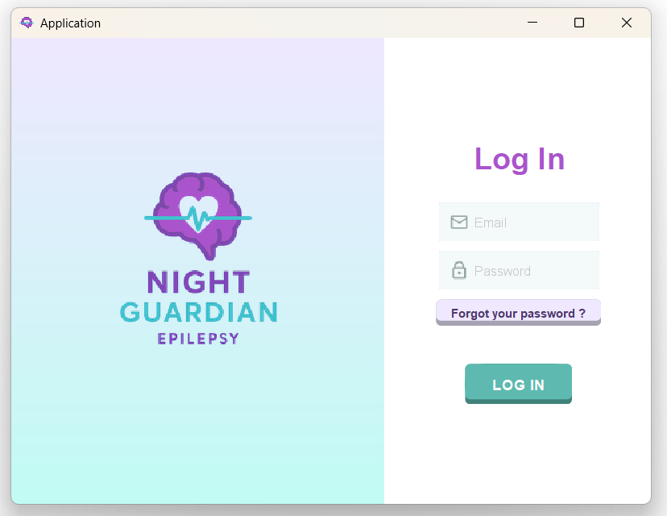

### Change password
To change the password, introduce a valid email and then click **"Forgot you password?"**. Then introduce the new password and click **Save**. 

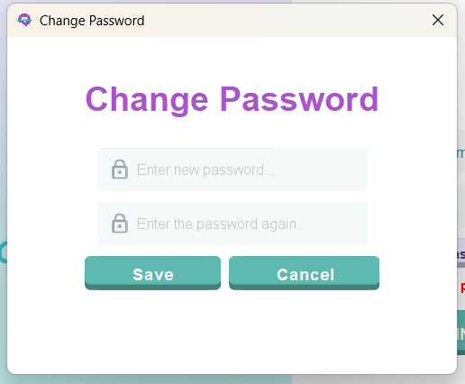

## Main Menu
After logging in, the Admin Main Menu displays seven options:
* **Create Patient**
* **Create Doctor**
* **Doctor List**
* **Patient List**
* **Verify Connected Clients**
* **Restart Server**
* **Log Out**

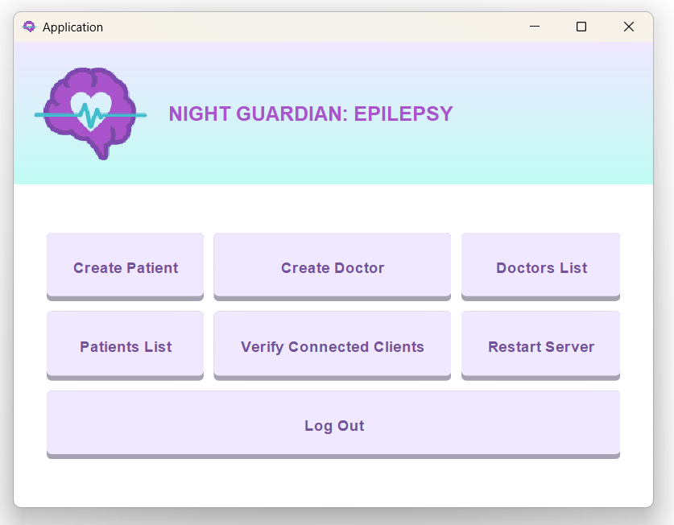

### Create Patient
Selecting **Create Patient** opens a form with eight fields, to be filled, distributed in two columns:

**Left column:**  
* Name  
* Gender (Female, Male, Non-binary)  
* Phone number  
* Email (`name@nightguardian.com`)  

**Right column:**  
* Surname  
* Date of birth (`YYYY-MM-DD`)  
* Assigned Doctor (dropdown with all active doctors)  
* Password  

**Buttons:**  
* **Cancel:** asks for confirmation before exiting without saving. If it was pressed by mistake, it goes back to the Create Patient screen.
  
  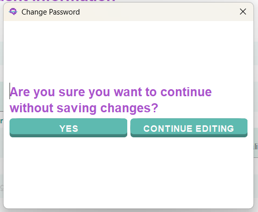  
* **Save and Go Back:** saves the patient and creates a pop-up showing the user's email, temporal password and single-use Token. Then returns to the Main Menu.
  
  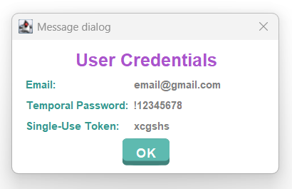

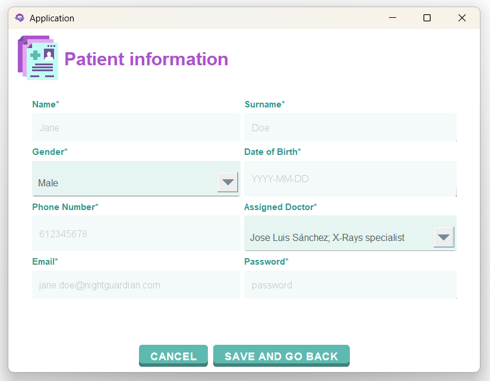

### Create Doctor
Selecting **Create Doctor** opens a similar form with seven fields to fill with the doctor's information:

**Left column:**  
* Name  
* Speciality  
* Phone number  
* Password  

**Right column:**  
* Surname  
* Department  
* Email (`name@nightguardian.com`)  

**Buttons:**  
* **Cancel:** confirmation dialog before losing changes. If it was pressed by mistake, it goes back to the Create Doctor screen.  
* **Save and Go Back:** stores the doctor and creates a pop-up showing the user's email, temporal password and single-use Token. Then returns to the Main Menu.  

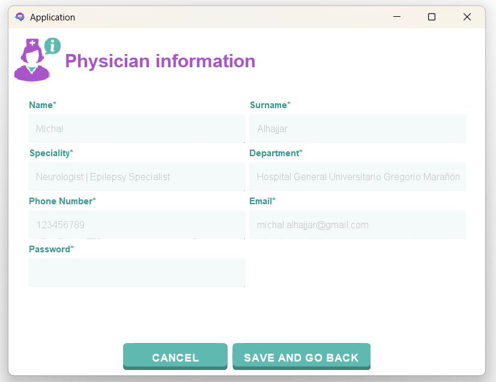

### Doctor List
This section displays all doctors in the system.

**Right panel:** scrollable list showing every Doctor's information:  
* Name and surname  
* Department  
* Speciality  
* Email  
* Phone number  
* Account status (Active / Inactive)  

**Left panel:**  
* **Search:** enter surname and click *Search*. If the doctor is not found, *Doctor not found* appears.  
* **Reset:** restores *Search* filter and shows full list.  
* **Deactivate User:** deactivates the selected doctor. A message confirming the status change will appear.
  * If a user is deactivated, they will not be able to logIn into the application.
  * This option's purpose is to deactivate the subscription of users that are not longer going to use the epilepsy monitoring service provided by the hospital.  
* **Back to Menu:** returns to Main Menu.  

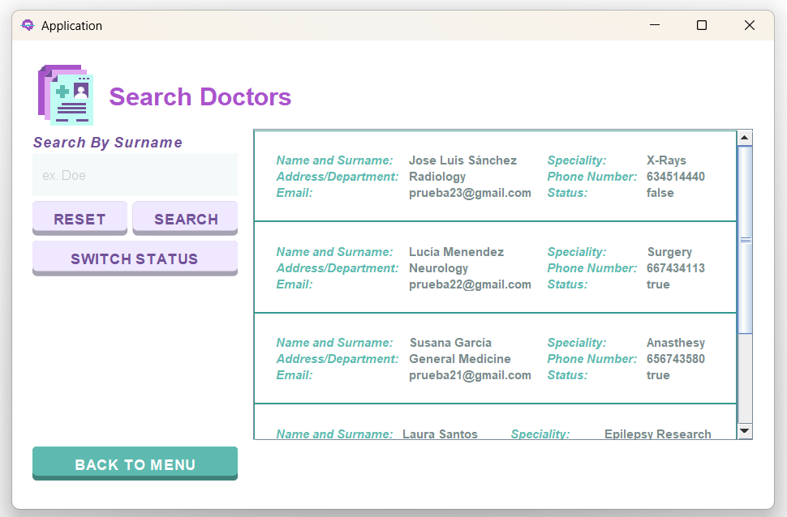 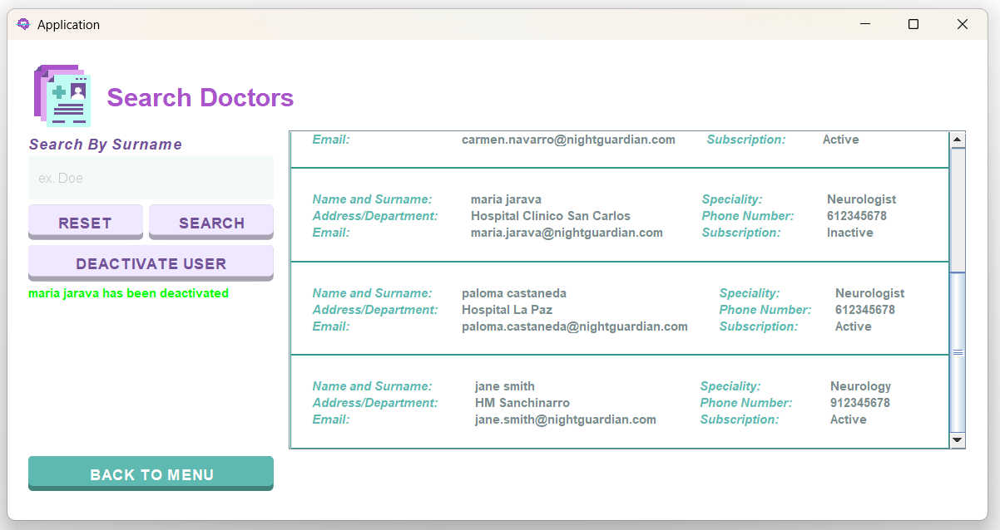

### Patient List
This section mirrors the Doctor List, but with patient information:

**Right panel:**  
* Name and surname  
* Date of birth  
* Gender  
* Email  
* Phone  
* Assigned doctor  
* Status (Active / Inactive)  

**Left panel:**  
* **Search:** by surname (shows *Patient not found* if none exist)  
* **Reset:** restores *Search* filter and shows full list.
* **Deactivate User:** deactivates selected patient. A message confirming the status change will appear.
  * If a user is deactivated, they will not be able to logIn into the application.
  * This option's purpose is to deactivate the subscription of users that are not longer going to use the epilepsy monitoring service provided by the hospital.  * 
* **Back to Menu:** returns to Main Menu  

 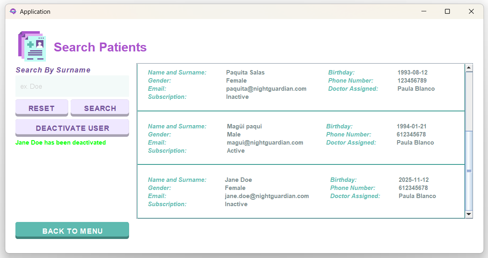

### Verify Connected Clients
Displays information about currently connected clients.

**Top panel:**  
* Total number of connected clients  
* List of all active users (Doctors, Patients)  

**Bottom buttons:**  
* **Stop Server:** requires admin password; stops the server only if all client are disconnected. 
* **Go Back:** returns to Main Menu  

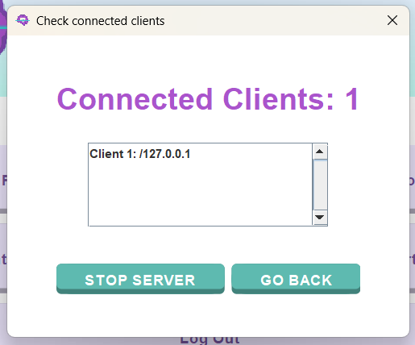

### Restart Server
This option manages server availability.

* If the server is **stopped**, it is restarted immediately

  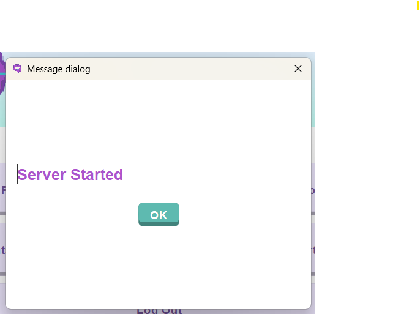
* If the server is **already running**, the following message appears:  
  **“The server is already running.”**  
  Clicking **OK** returns to the Main Menu  
  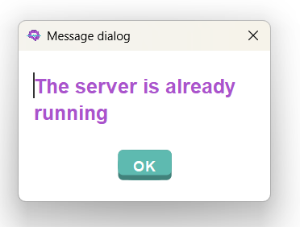

### Log Out
Selecting **Log Out** returns to the log in screen.  

## Closing the Application
When closing the application, if there are still clients connected to the server, a confimation dialog will be displayed: 
* **Yes**: closes all client's connections and stops the server.
* **No**: the dialog is disposed. 

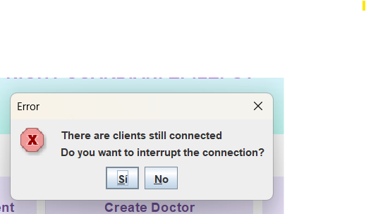

## Authors
* [@MariaMM04](https://github.com/MariaMM04)
* [@MamenCortes](https://github.com/MamenCortes)
* [@MartaSanchezDelHoyo](https://github.com/MartaSanchezDelHoyo)  
* [@paulablancog](https://github.com/paulablancog)  
* [@Claaublanco4](https://github.com/Claaublanco4)
